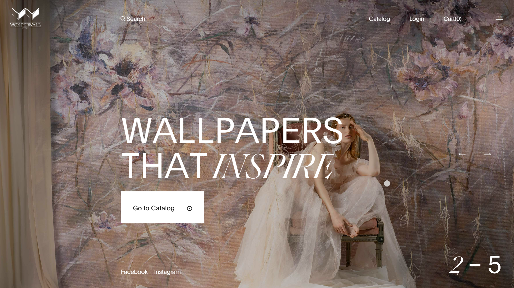
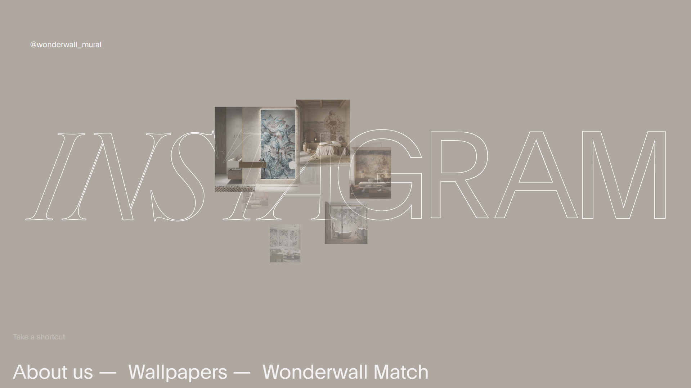

# Wonderwall Studio Clone

A high-fidelity clone of [Wonderwall Studio](https://wonderwall-studio.pl/), built with smooth scrolling, GSAP animations, and interactive UI elements.

## 🚀 Features

- **GSAP Animations:** Smooth transitions, scroll-based effects, and engaging micro-interactions.
- **Lenis Smooth Scrolling:** Enhanced scrolling experience for a seamless feel.
- **Parallax Scrolling:** Depth effects for an immersive user experience.
- **Image Trail Effects:** Unique cursor-following image trails for visual engagement.
- **Small Interactions:** Hover effects, subtle animations, and UI responsiveness.

## 🛠️ Tech Stack

- **HTML, CSS, JavaScript** – Core structure and styling.
- **GSAP** – For animations and scroll-based effects.
- **Lenis** – For smooth scrolling experience.

## 📸 Screenshots

### Landing Page



### Contact Page



## 📂 Setup & Installation

1. Clone the repo:
   ```bash
   git clone https://github.com/oliverfelixdev/Wonderwall.git
   ```
2. Open `index.html` in a browser or use Live Server in VS Code.

## 🔮 Future Improvements

- Add lazy loading for better performance.
- Optimize animations for lower-end devices.
- Enhance responsiveness for mobile users.

## 👤 Author

**Olie (Oliver Felix)**

- GitHub: [@oliverfelixdev](https://github.com/oliverfelixdev)
- Portfolio: _Coming soon_

## 📜 License

This project is for educational purposes only. All rights belong to the original Wonderwall Studio team.
